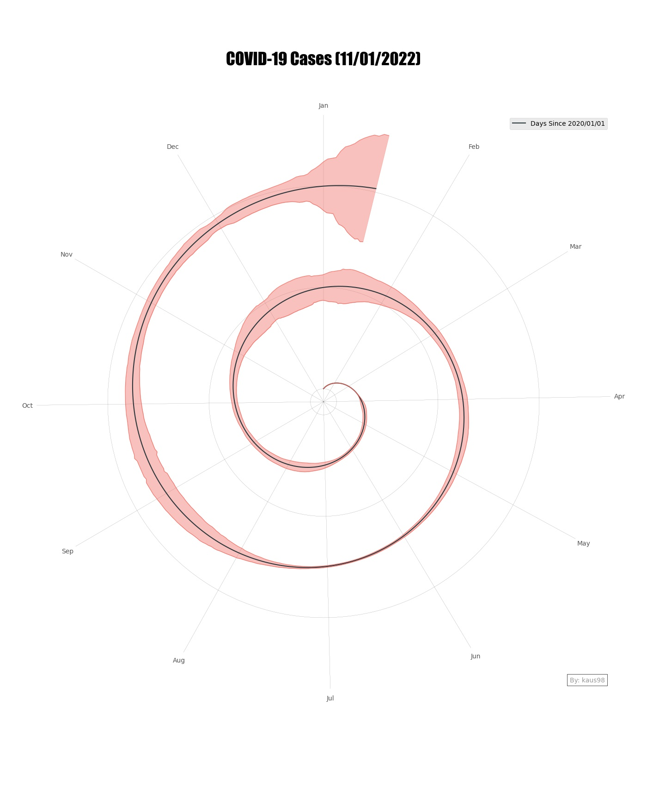

# Recreating the New York Times Covid-19 Spiral Graph in Python
Recently New York Times published an article with Spiral Graph representing the spread of Confirmed COVID-19 cases in US. The piece in question is titled [Here’s When We Expect Omicron to Peak.](https://www.nytimes.com/2022/01/06/opinion/omicron-covid-us.html) The opener image, which attracted a lot of attention on Twitter, shows the number of new COVID cases in the U.S. since the beginning of 2020. 


## Recreating the Graph with Python
Despite the negative comments for spiral graphs to represent the data, i wanted to recreate the Graph, not in R like others but in python using only Matplotlib. I also wanted the option to add mutiple countries in Spiral Graph for Comparison. 

## Load and Preprocess the raw Data
We use the COVID-19 Dataset by [Our World in
Data](https://github.com/owid/covid-19-data) for the number of confirmed
Coronavirus cases all around the worlds. We will also add the options to plot other parameters including Smoothed Covid Cases, Deceased Cases and Positivity Rates.

## Downloading the Dataset
To Download the Dataset, we can use Wget python Library or manually [download](https://covid.ourworldindata.org/data/owid-covid-data.csv) and place the file in working directory. 
``` python
wget.download('https://covid.ourworldindata.org/data/owid-covid-data.csv', "data/Covid_Data.csv")
```
## Preprocessing the Data
Since the original chart starts on January 1st, 2020, while the first
cases for each country are presented on different dates, we add all
the days from January 1st to the first date in the data. We also divided the Data for each country to different files based on ISO and placed in different files for ploting.

We also add the Extra Column of Days Passed since 2020-01-01 for Each Country. The day of the year will be our x-axis while the y-axis will denote the confirmed cases in country.

``` python
def preprocess_data(path: str, 
                    country_codes: list, 
                    start_date: str = "2020-01-01", 
                    save_path: str = "data/",
                    cols_: list = ["total_cases", "new_cases", "new_cases_smoothed", "total_deaths", "new_deaths", "new_deaths_smoothed", "positive_rate"]):
    World_ = pd.read_csv(path)
    World_.fillna(0, inplace = True)
    World_['date'] = World_['date'].astype(str)
    
    for cc in country_codes:
        country_data = World_[World_["iso_code"] == cc]
        end_date = country_data.date.min()
        
        temp = pd.DataFrame(pd.date_range(start_date, end_date)[:-1], columns = ["date"])
        for col_ in cols_:
            temp[col_] = 0
        
        country_data = pd.concat([temp, country_data[temp.columns]], axis = 0)
        country_data['date'] = pd.to_datetime(country_data['date'])
        country_data['days_passed'] = (country_data['date'] - pd.to_datetime(start_date))/86400000000000
        country_data['days_passed'] = country_data['days_passed'].astype(int)
        
        country_data.to_csv(os.path.join(save_path,f"{cc}_Data.csv"), index = False, header = True)
```

### Building Simple Spiral Graph
We will start with building very simple Spiral graph in python which will act as base function for all the graphs. Some important features to note for this base class are:
* We will divide the spiral angles for each month based on number of days present in each month.
* We will add the Y Ticks for starting of each year.
* We will also add Watermark to add your name on bottom right.
* Offset is added to not start the graph from zero.
``` python
def get_graph_base(max_n: int, 
                   line_color: str, 
                   offset_radius: int = 100,
                   ancor_text: str = "By: kaus98"):
    months = pd.Series([31, 28.25, 31, 30, 31, 30, 31, 31, 30, 31, 30, 31]).cumsum() #Calendar to set angles for each month
    angles = pd.Series(np.linspace(0, 2*np.pi*(max_n/365) , max_n))
    radius = pd.Series(list(range(max_n))) + offset_radius
    
    fig = plt.figure(figsize=(14,15)) 
    ax = fig.add_subplot(111, polar=True)
    
    ax.set_theta_direction(-1) # Make Graph go Clockwise 
    ax.set_theta_offset(np.pi/2.0) # Add Offset of 90 Deg
    ax.set_xticks(np.deg2rad(months/months.max()*360).values) 
    ax.set_xticklabels([ 'Feb', 'Mar', 'Apr', 'May', 'Jun', 'Jul', 'Aug', 'Sep', 'Oct', 'Nov', 'Dec','Jan']) # Setting the Labels for X Ticks
    ax.set_yticks([0+offset_radius,365+offset_radius, 2*365+offset_radius]) # Adding the Y-Ticks for Each Year
    ax.set_yticklabels(["", "", ""])    
    ax.grid(True, color = "#000000", linewidth = "0.1", linestyle = "solid" )
    
    # Making the Base Spiral Line 
    ax.plot(angles, radius, "--", color = line_color, linewidth = "1.2", label = "Days Since 2020/01/01")
    ax.legend(loc = "upper right")
    ancor_text = AnchoredText(ancor_text, loc = "lower right", prop=dict(alpha=0.4)) # Adding the Watermark Text
    ax.add_artist(ancor_text)
    
    ax.set_title("COVID-19 Cases (11/01/2022)", y = 1.08, fontdict={"fontsize":26, "fontname": "impact"}) # Setting the Title
    return fig, ax, angles, radius

```
This will give us plain Spiral Graph without any covid Markers.


Now we have plain spiral graph, we can start adding the markers of covid new cases in any country. First we will add for US to check if we are getting similar graph as NY Times.
<table><tr>
<td>  </td>
<td>  </td>
</tr></table>
